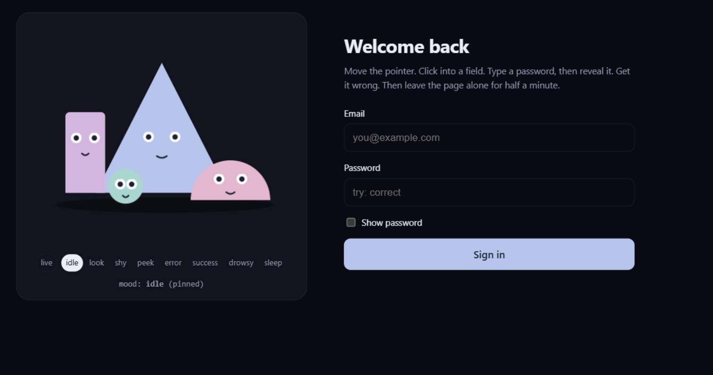

<p align="center">
  <a href="https://janobarnard.github.io/form-friends/">
    
  </a>
</p>

<h1 align="center">Form Friends</h1>

<p align="center">
  Four little SVG characters that sit next to your form and pay attention to it.
</p>

<p align="center">
  <a href="https://janobarnard.github.io/form-friends/"><b>Live demo</b></a> ·
  <a href="#use-it">Use it</a> ·
  <a href="#how-it-works">How it works</a> ·
  <a href="#api">API</a> ·
  <a href="./NOTES.md">Notes</a>
</p>

<p align="center">
  
  
  
  
  
</p>

---

They follow your pointer around the page. They turn to look at whichever field
you focus. They pointedly look away when you type a password - except the coin,
which sneaks a glance back. They sag when a sign-in fails, hop when it works,
and if you leave the page alone long enough they get visibly tired and nod off,
one at a time.

**No dependencies beyond React.** No canvas, no animation library, no image
assets. Inline SVG, one stylesheet, one hook. Three files, written to be read:
the non-obvious decisions are commented, and [`NOTES.md`](./NOTES.md) explains
the ones that look like mistakes.

## Try it

```bash
git clone https://github.com/janobarnard/form-friends
cd form-friends
npm install
npm run dev
```

The demo is a stand-in sign-in page with a button for every mood, a theme
toggle and a few palettes. The password that works is `correct`.

## Use it

There is no npm package to install. Copy the three files from `src/` into your
project:

| File | Owns |
|---|---|
| [`FormFriends.tsx`](./src/FormFriends.tsx) | **Geometry.** The four bodies, eyes and mouths, and which face each character pulls in each mood. |
| [`form-friends.css`](./src/form-friends.css) | **Pose and motion.** Where faces travel, the look-away directions, blink clocks, the sleep droop, reduced-motion rules. |
| [`useFormFriends.ts`](./src/useFormFriends.ts) | **Behaviour.** Decides what the cast is feeling and where it is looking, from your form's events. |

Then wire them up:

```tsx
import { useState } from "react";
import { FormFriends } from "./form-friends/FormFriends";
import { useFormFriends } from "./form-friends/useFormFriends";
import "./form-friends/form-friends.css";

function SignIn() {
  const friends = useFormFriends();
  const [password, setPassword] = useState("");
  const [showPassword, setShowPassword] = useState(false);

  async function onSubmit(e: React.FormEvent) {
    e.preventDefault();
    try {
      await signIn(password);
      friends.success();
    } catch {
      friends.error();
    }
  }

  return (
    <>
      {/* the gaze is measured from this box and written to it */}
      <div className="ff-stage" ref={friends.sceneRef}>
        <FormFriends mood={friends.mood} />
      </div>

      {/* focus inside this container steers them */}
      <form ref={friends.formRef} onSubmit={onSubmit}>
        <input type="email" {...friends.fieldProps()} />

        <input
          type={showPassword ? "text" : "password"}
          value={password}
          onChange={(e) => setPassword(e.target.value)}
          {...friends.passwordProps()}
        />

        <label>
          <input
            type="checkbox"
            checked={showPassword}
            {...friends.revealProps({
              onChange: (e) => setShowPassword(e.target.checked),
            })}
          />
          Show password
        </label>

        <button>Sign in</button>
      </form>
    </>
  );
}
```

That is the whole integration. [`demo/Demo.tsx`](./demo/Demo.tsx) is the same
thing, complete and runnable.

The bindings take your own handlers and wrap them, so nothing of yours is lost.
They also carry two details that are easy to get wrong by hand:

- Focusing a password field that is **already revealed** goes to the peek pose,
  not the shy one. Looking away from a password everyone can see reads as a bug.
- Clicking the show/hide control blurs the password field first. Left alone,
  that flashes back to pointer-following for a frame mid-hand-off. The bindings
  suppress it, which is what the `data-ff-reveal` attribute is for.

`.ff-stage` is an optional wrapper that gives the scene a sensible width. Set
your own and skip it.

## What they never see

Nothing in this library reads a field's value. The password bindings only
listen for focus and blur; the controller never receives what was typed. The
whole scene is `aria-hidden` - it is decoration, so it is never announced to a
screen reader and never in the tab order.

## Moods

| Mood | When | What happens |
|---|---|---|
| `idle` | nothing going on | slow bob, occasional independent glances |
| `look` | a normal field has focus | attention on the caret |
| `shy` | a password field has focus | everyone looks away, each their own direction |
| `peek` | password revealed | more emphatic looking away, one sneaks back |
| `error` | submit failed | faces drop, sad brows, a slow unhappy rock |
| `success` | submit worked | eyes shut, mouths open, a hop |
| `drowsy` | ~18s of nothing | heavy lids, slow blinks, faces sagging |
| `sleep` | ~28s of nothing | asleep one at a time, floating `z`s |

`error` and `success` hold until the person touches the form again. Thresholds
are options on the hook, and you can always set `mood` yourself.

## Restyling

The cast is five CSS custom properties. Override them anywhere above the scene
and every body, pupil and mouth follows:

```css
:root {
  --ff-char-1: #b7c4ec; /* the triangle */
  --ff-char-2: #d3b6e0; /* the wall     */
  --ff-char-3: #e3b7cd; /* the dome     */
  --ff-char-4: #a9d6cf; /* the coin     */
  --ff-ink: #1c2030;    /* pupils, mouths, the z's */
}
```

Light and dark are built in: the shadow and chip colours follow
`prefers-color-scheme`, and a `data-theme="light"` or `data-theme="dark"`
attribute on `<html>` wins over it. Nothing else in the stylesheet touches
your page.

The characters have no names. If names mean something in your product, pass
them and they appear as a chip on hover:

```tsx
<FormFriends mood={friends.mood} labels={["ada", "grace", "alan", "edsger"]} />
```

## How it works

Three layers compose to make four shapes read as a crowd:

1. **Whole faces slide around the body** toward the gaze target, clipped to the
   body silhouette, with pupils adding a little parallax on top. Front-row
   characters travel further than the back row.
2. **Per-character reactions.** Each looks away its own way on a password, two
   sneak peeks back, and every character blinks on its own near-co-prime clock
   so the group never blinks in unison.
3. **Body language.** Everyone leans toward the field they watch, the triangle
   crumples on an error, and success is a staggered hop.

The component owns geometry. The stylesheet owns pose and motion, keyed off a
`data-mood` attribute on the `<svg>`, so a new mood is a new attribute value
plus CSS rules. The hook decides the mood and where to look.

### Why the gaze never touches React

`useFormFriends` writes the gaze onto the scene container as two CSS custom
properties, `--ff-lx` and `--ff-ly`, which inherit down to every face. React
state holds only the mood, which changes when a person does something rather
than when a pointer moves.

That is the whole reason this is smooth. Measured on a real sign-in page with
the gaze in `useState` instead:

| | gaze in React state | gaze written to the DOM |
|---|---|---|
| 1 pointer move | full re-render of the scene **and the surrounding form** | no re-render |
| 100 pointer moves | 100 re-renders | **0** |
| forced layout reads | 1 per move | **1 total** (rect cached) |

Same idea elsewhere: idle timers re-arm at most twice a second, the scene's
rect is cached instead of measured every frame, and every animation pauses
while the tab is hidden.

### Motion and accessibility

`prefers-reduced-motion: reduce` removes the sweeping movement: the bob, the
hop, the error shake, the sways, the idle glances and the gaze transitions.
Blinking and the small mouth twitch deliberately survive, and so do the state
transitions on lids, faces and pupils. They are tiny and non-vestibular, and
cutting them turns every mood change into a jarring simultaneous snap. The
characters still read as alive; they just stop travelling.

## API

### `<FormFriends />`

| Prop | Type | |
|---|---|---|
| `mood` | `Mood` | required. One of the eight moods above. |
| `look` | `{ x: number; y: number }` | optional gaze, each axis -1..1. Only for driving the gaze yourself without the hook; costs a render per change. |
| `labels` | `readonly string[]` | optional name per character, shown as a chip on hover. |

### `useFormFriends(options?)`

| Option | Default | |
|---|---|---|
| `drowsyAfterMs` | `18000` | idle time before the cast looks tired |
| `sleepAfterMs` | `28000` | idle time before they fall asleep |
| `attentionMs` | `1600` | how long a keystroke or focus holds their attention against the pointer |

Returns:

| | |
|---|---|
| `mood` | pass to `<FormFriends mood={...} />` |
| `sceneRef` | attach to the box the gaze is measured from and written to |
| `formRef` | attach to the container whose focus events steer the gaze |
| `fieldProps(own?)` | spread onto ordinary inputs |
| `passwordProps(own?)` | spread onto password inputs |
| `revealProps(own?)` | spread onto the show-password **checkbox** |
| `error()` / `success()` | call after a submit |
| `watch()` `shy()` `unshy()` `peek(showing)` `lookAt(x, y)` | the individual handlers, if the bindings do not fit |

## Licence

[MIT](./LICENSE). Use it in anything, commercial or not; keep the copyright
line.
